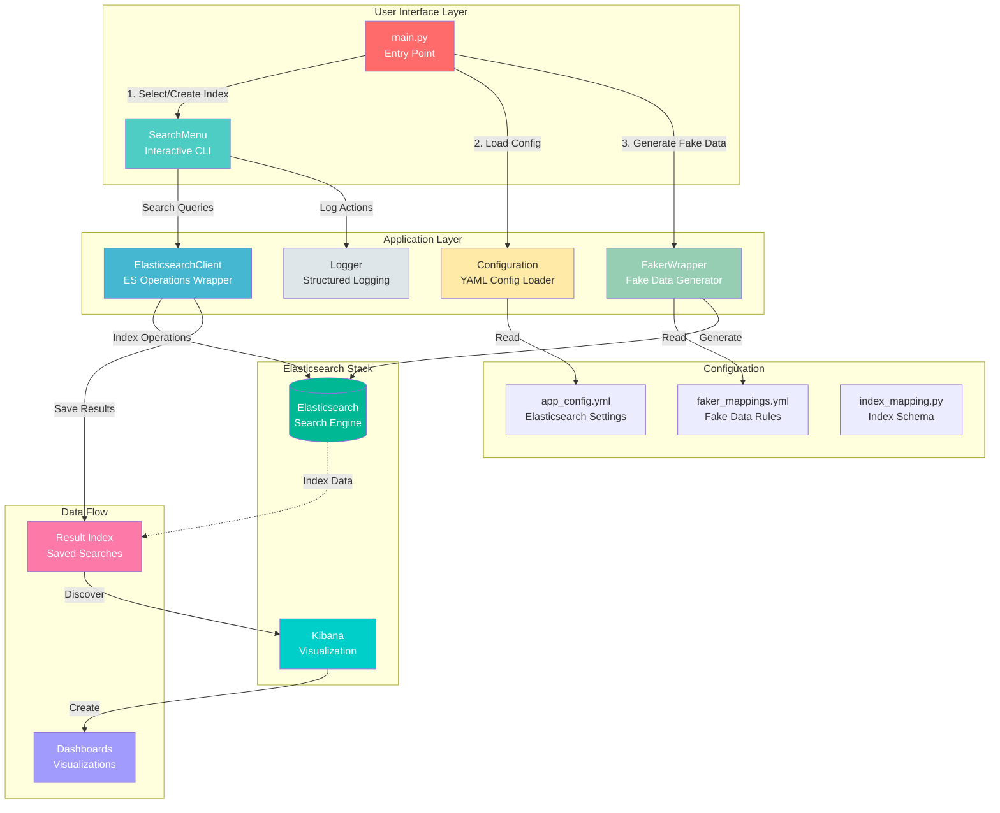

> ⚠️ **DISCLAIMER:** This project generates and uses **synthetic (fake) movie data** created by the Python Faker library. All movie titles, names, ratings, and other information are randomly generated and completely fictional. This project is intended for educational purposes, Elasticsearch practice, and demonstration of search functionality. No real movies, actors, or reviews are used.


# 🎬 Movie Search with Elasticsearch

A Python-based movie search application powered by **Elasticsearch** with advanced search capabilities, **synthetic (fake) data generation using Faker**, and seamless **Kibana** integration for data visualization.

> ⚠️ **Note:** This project uses **synthetically generated fake data** created by the Python Faker library. All movie titles, director names, actor names, and other information are randomly generated and not real. This project is for learning and demonstration purposes only.


---

## ✨ Features

### 🔍 **Advanced Search Capabilities**
- **Basic Search** - Match queries on any field
- **Fuzzy Search** - Typo-tolerant search with customizable fuzziness levels
- **Range Search** - Find documents within numeric ranges (ratings, duration, etc.)
- **Date Range Search** - Filter movies by release date
- **Multi-Field Search** - Search across multiple fields simultaneously
- **Bool Queries** - Combine multiple conditions with AND/OR logic

### 🎲 **Synthetic (Fake) Data Generation**
- Generate **realistic but fake** movie data using **Faker** library
- All data is randomly generated: movie titles, directors, actors, ratings, etc.
- No real movie data is used - perfect for testing and demos
- Customizable field mappings via YAML configuration
- Support for various data types: text, dates, numbers, categories
- Generate any number of fake documents (10, 1000, 100,000+)
- Bulk indexing for high-performance data loading

### 📊 **Kibana Integration**
- Save search results directly to new Elasticsearch indexes
- Export Query DSL for use in Kibana Dev Tools
- Ready-to-use data for Discover and Dashboard visualizations
- Manage result indexes (create/delete) from CLI

### 🛠️ **Developer Friendly**
- Clean, object-oriented architecture
- Comprehensive error handling with decorators
- Structured logging with colored console output
- YAML-based configuration management
- Type hints and detailed docstrings

---

## 📋 Table of Contents

- [Architecture](#-architecture)
- [Prerequisites](#-prerequisites)
- [Installation](#-installation)
- [Configuration](#-configuration)
- [Usage](#-usage)
- [Search Examples](#-search-examples)
- [Kibana Visualization](#-kibana-visualization)
- [Project Structure](#-project-structure)
- [Contributing](#-contributing)
- [License](#-license)

---

## 🏗️ Architecture



---

## 📦 Prerequisites

- **Python** 3.8 or higher
- **Elasticsearch** 8.x (running on `localhost:9200`)
- **Kibana** 8.x (optional, for visualization - running on `localhost:5601`)

---

## 🚀 Installation

### 1. Clone the Repository

```bash
git clone https://github.com/yourusername/movie-search.git
cd movie-search
```

### 2. Create Virtual Environment

```bash
# Windows
python -m venv venv
venv\Scripts\activate

# Linux/Mac
python3 -m venv venv
source venv/bin/activate
```

### 3. Install Dependencies

```bash
pip install -r requirements.txt
```

### 4. Start Elasticsearch & Kibana

```bash
# Using Docker (recommended)
docker-compose up -d

# Or manually start your local installations
```

---

## ⚙️ Configuration

### Elasticsearch Connection

Edit `configuration/app_config.yml`:

```yaml
elasticsearch:
  host: "http://localhost"
  port: "9200"
  username: "elastic"      # Optional
  password: "your_password" # Optional

logger:
  level: "INFO"
  format: "%(asctime)s - %(name)s - %(levelname)s - %(message)s"
```

### Fake Data Mappings (Synthetic Data)

Customize how **fake movie data** is generated in `data/faker_mappings.yml`:

```yaml
mappings:
  movie_title:
    faker: sentence        # Random fake movie titles
    kwargs:
      nb_words: 4
  director:
    faker: name            # Random fake director names
  main_actor:
    faker: name            # Random fake actor names
  genre:
    faker: random_element
    kwargs:
      elements:
        - Action
        - Comedy
        - Drama
        - Horror
        - Sci-Fi
  release_date:
    faker: date_between    # Random dates
    kwargs:
      start_date: '-20y'
      end_date: 'now'
  users_rating:
    faker: uniform          # Random ratings 1-10
    kwargs:
      min_value: 1
      max_value: 10
  imdb_rating:
    faker: uniform          # Random ratings 1-10
    kwargs:
      min_value: 1
      max_value: 10
```

---

## 🎮 Usage

### Basic Usage

```bash
python main.py
```

### Interactive Menu

```
🎬 Choose an option:

1.  🔍 Basic Search (Match)
2.  🔍 Fuzzy Search (Typo-tolerant)
3.  📊 Range Search (Numeric fields)
4.  📅 Date Range Search
5.  🔍 Multi-Field Search
6.  📋 Show Available Fields
7.  📊 Show Document Count
8.  🎲 Show Sample Documents
9.  🗑️  Manage Result Indexes
0.  🚪 Exit
```

### Workflow

1. **Create or select an index** → Load it with fake movie data
2. **Search** → Use various search methods to explore movies
3. **Visualize** → Save results to Kibana for dashboards

---

## 🔍 Search Examples

### 1. Fuzzy Search (Typo-Tolerant)

```
Search: "actoin" in genre field
Result: Finds all "Action" movies
```

### 2. Range Search

```
Field: imdb_rating
Min: 7.0 | Max: 10.0
Result: Top-rated movies only
```

### 3. Date Range Search

```
Field: release_date
From: 2020-01-01 | To: 2024-12-31
Result: Recent movies in the last 5 years
```

### 4. Multi-Field Search

```
Director: "Christopher Nolan"
Genre: "Action"
Result: Action movies by Christopher Nolan
```

### 5. Save Results for Kibana

After any search, choose option 3 to save results to a new index:

```
📋 What would you like to do?
1. 📄 Show results here
2. 🔗 Get Query DSL (for Kibana)
3. 💾 Save results to new index (for Kibana Visualization)
```

---

## 📊 Kibana Visualization

### Step 1: Create Data View

1. Open **Kibana** → `http://localhost:5601`
2. Go to **Stack Management** → **Data Views**
3. Click **Create data view**
4. Enter pattern: `your_index_results_*`
5. Select timestamp field: `release_date`

### Step 2: Explore Data in Discover

1. Go to **Discover**
2. Select your data view
3. Use **KQL** for quick filtering:
   ```
   genre: "Action" and imdb_rating >= 7
   ```

### Step 3: Create Visualizations

**Example Dashboards You Can Build:**

| Visualization Type | Use Case |
|-------------------|----------|
| **Bar Chart** | Movies per genre |
| **Line Chart** | Average rating over years |
| **Pie Chart** | Genre distribution |
| **Metric** | Total movies, average rating |
| **Data Table** | Top-rated movies list |


---
## 🎲 About the Data

### ⚠️ Important: All Data is Fake

This project generates and uses **100% synthetic (fake) data**. Here's what you need to know:

| Aspect | Details |
|--------|---------|
| **Data Source** | Generated by Python Faker library |
| **Movie Titles** | Random sentences, not real movies |
| **Director Names** | Randomly generated names |
| **Actor Names** | Randomly generated names |
| **Ratings** | Random numbers between 1-10 |
| **Dates** | Random dates within last 20 years |
| **Purpose** | Testing, learning, demonstration |

### Why Fake Data?

- ✅ **Safe**: No real personal data, no copyright issues
- ✅ **Scalable**: Generate millions of records for testing
- ✅ **Customizable**: Control data structure and distribution
- ✅ **Reproducible**: Same configuration = same data patterns
- ✅ **Shareable**: Share your project without privacy concerns

### Data Generation Examples

```python
# Example of generated fake movie document:
{
  "movie_title": "Specific back thus nearly particular industry.",
  "director": "Lisa Snyder",
  "main_actor": "Terrance Wilkinson",
  "genre": "Comedy",
  "release_date": "2020-01-10",
  "users_rating": 6,
  "imdb_rating": 2
}
```
---

## 📁 Project Structure

```
movie-search/
├── main.py                      # Application entry point
├── requirements.txt             # Python dependencies
├── README.md                    # Project documentation
│
├── configuration/
│   └── app_config.yml           # App & Elasticsearch settings
│
├── data/
│   ├── faker_mappings.yml       # Fake data generation rules
│   └── index_mapping.py         # Elasticsearch index schema
│
├── src/
│   ├── configuration.py         # YAML config loader
│   ├── elasticsearch_client.py  # Elasticsearch operations wrapper
│   ├── faker_class.py           # Faker data generator
│   ├── logger.py                # Structured logging
│   └── search_menu.py           # Interactive CLI search menu
│
└── venv/                        # Virtual environment
```

---

## 🧪 Testing

```bash
# Run the application in test mode
python main.py

# Create a test index with sample data
# Use option 1: "Search by field"
# Test with genre: "Action"
```

---

## 🔧 Troubleshooting

### Elasticsearch Connection Failed

```bash
# Check if Elasticsearch is running
curl http://localhost:9200

# Check connection details in config
cat configuration/app_config.yml
```

### Kibana Can't Find Data

```bash
# Refresh index patterns
# Kibana → Stack Management → Data Views → Refresh
```

### No Results Found

- Check if index exists: Use option 6 (Show Available Fields)
- Verify field names: Use option 2 (Show Available Fields)
- Generate sample data: Create a new index with fake data

---

## 🤝 Contributing

Contributions are welcome! Here's how:

1. Fork the repository
2. Create a feature branch:
   ```bash
   git checkout -b feature/amazing-feature
   ```
3. Commit your changes:
   ```bash
   git commit -m 'Add amazing feature'
   ```
4. Push to the branch:
   ```bash
   git push origin feature/amazing-feature
   ```
5. Open a Pull Request

---

## 📝 Future Enhancements

- [ ] Add autocomplete/suggestions search
- [ ] Implement pagination for large result sets
- [ ] Add export to CSV/JSON functionality
- [ ] Create pre-built Kibana dashboard templates
- [ ] Add unit tests with pytest
- [ ] Implement search history feature
- [ ] Add support for Elasticsearch aggregations
- [ ] Create web UI with Flask/FastAPI

---

## 🛠️ Built With

- [Python](https://www.python.org/) - Programming language
- [Elasticsearch](https://www.elastic.co/elasticsearch/) - Search engine
- [Kibana](https://www.elastic.co/kibana/) - Data visualization
- [Faker](https://faker.readthedocs.io/) - Fake data generation
- [PyYAML](https://pyyaml.org/) - YAML configuration

---

## 📄 License

This project is licensed under the MIT License - see the [LICENSE](LICENSE) file for details.

---

## 👤 Author

**Your Name**
- GitHub: [@javad-hosseini](https://github.com/javad-hosseini)
- LinkedIn: [seyed-mohammad-javad-hosseini](https://www.linkedin.com/in/seyed-mohammad-javad-hosseini-b52962280/)

---

## 🙏 Acknowledgments

- [Faker Library](https://faker.readthedocs.io/) - For generating realistic fake data
- [Elasticsearch](https://www.elastic.co/) - Search engine documentation
- [Python Elasticsearch Client](https://elasticsearch-py.readthedocs.io/) - Official Python client

> **Note:** This project does not use any real movie data, reviews, or ratings. All data is synthetically generated using the Faker library.
---

## ⭐ Support

Give a ⭐️ if this project helped you!

---

## 📸 Screenshots

### Interactive Search Menu
```
🎥 CURRENT INDEX: movie_reviews
==================================================
1. 🔍 Basic Search (Match)
2. 🔍 Fuzzy Search (Typo-tolerant)
3. 📊 Range Search (Numeric fields)
...
```

### Query DSL Export
```json
GET /movie_reviews/_search
{
  "query": {
    "fuzzy": {
      "genre": {
        "value": "actoin",
        "fuzziness": "AUTO"
      }
    }
  }
}
```

### Saved Results Index
```
💾 Saving results to: movie_reviews_results_20260101_120000

✅ SUCCESS! Results saved for Kibana
📊 Index name: movie_reviews_results_20260101_120000

📋 Now in Kibana:
   1. Go to Stack Management > Data Views
   2. Create data view: movie_reviews_results_*
   3. Go to Discover to see results
   4. Create visualizations from there
```

---

**Happy Searching! 🎬🔍**
